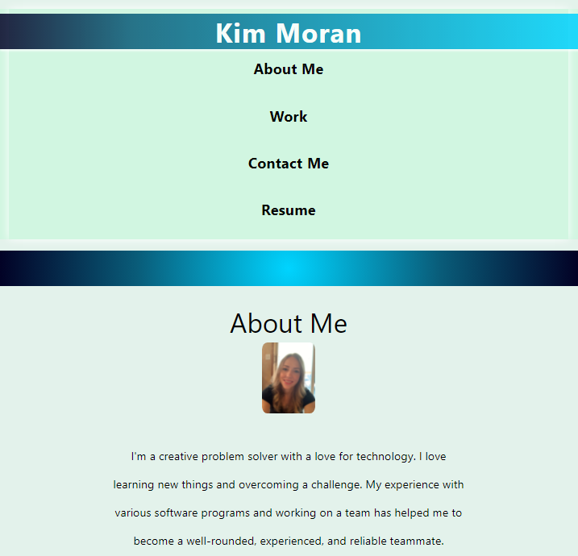

# kmoran-developer-portfolio
Portfolio page for developer Kim Moran

##I created a profile page featuring my basic contact info, some of my work, and how to stay in touch with me on social.  This page could be used on any social profile or as a link to any potential employer since it provides all of my info.

I enjoyed building this project to work on my skills in css and html. The html piece was fairly straightforward to grasp but the css took much more tinkering and I discovered many additional cool features that css has. I enjoyed (and labored over) figuring out certain pieces of the css puzzle as I worked on each section of the page (from top to bottom).

 ```md
 
```